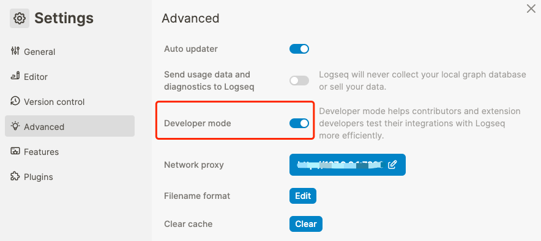
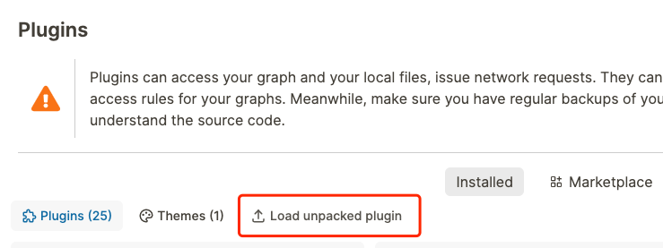

[English](README.md) | 中文

# logseq-media-ts-pro

为音视频建立时间戳，方便您学习、复盘会议或是复读。

## 功能特色

- 支持本地音视频，网络音视频和 B 站视频。
- 快速生成音视频时间戳，点击时间戳可直接跳转到音视频对应的时间点。
- 时间戳支持时间范围，点击时间戳会从指定起始时间播放到指定结束时间。(B 站不支持)
- 范围时间戳上可设定播放次数，是一个方便的复读功能。
- 可在页面上插入一个时间戳播放器，通过播放器筛选要播放的时间戳以及控制时间戳的顺序播放，支持循环播放。

## 如何安装

1. 从 [Releases](https://gitee.com/sethyuan/logseq-media-ts/releases) 页面下载最新的 zip 文件。
1. 将压缩文件解压到你想要存储插件的文件夹中。
1. 在 Logseq 中开启开发者模式。 
1. 通过插件页面的 `Load unpacked plugin` 按钮加载解压后的文件夹（名为 `logseq-media-ts-pro`）。 
1. 现在应该已经可以看到插件安装好了。

## 使用展示

### 如何插入音视频

https://github.com/sethyuan/logseq-media-ts/assets/3410293/74a877f3-ee30-40a2-83ae-259a99feb0a1

### 如何插入单一时间点的时间戳

https://github.com/sethyuan/logseq-media-ts/assets/3410293/27a8191d-2919-4ef8-bfbc-f2d5398d65f4

### 如何插入范围时间戳

https://github.com/sethyuan/logseq-media-ts/assets/3410293/56e604cd-0f60-496b-85ab-ac7e79cf85b3

### 如何指定播放次数以及播放间隔时间

https://github.com/sethyuan/logseq-media-ts/assets/3410293/a1e85608-22ef-4fb7-b17a-514f4599f634

### 如何插入及使用控制条

https://github.com/sethyuan/logseq-media-ts/assets/3410293/21919b82-77fc-4158-a6a0-5bad7978bf0d

控制条现在支持开启循环播放了。

## 时间戳语法参考

### 单一时间点

不与任何音视频绑定的：

```
{{renderer :media-timestamp, time}}
```

与某个特定音视频绑定的：

```
{{renderer :media-timestamp, time, ((音视频块的引用))}}
```

### 范围

不与任何音视频绑定的：

```
{{renderer :media-timestamp, from, to, [播放次数], [每次播放的间隔]}}
```

与某个特定音视频绑定的：

```
{{renderer :media-timestamp, from, to, [播放次数], [每次播放的间隔], ((音视频块的引用))}}
```

`播放次数`默认为`1`。

`每次播放的间隔`的单位是秒，并且默认为`1`。

## 控制条语法参考

```
{{renderer :media-ts-control, 间隔, [过滤标签]}}
```

`间隔`是在时间戳之间停留的时长。

`过滤标签`是以`[[tag]]`这种写法指定的过滤用标签，只有拥有这个标签的块下面的时间戳会被播放，如没有指定过滤标签则屏幕上所有出现的时间戳都将被播放。

## 加入社群

请扫以下二维码加我微信，我拉您进群。微信群仅用来讨论插件相关主题。


## 注意事项

B 站视频由于 Logseq 沙箱安全限制，无法直接获得其时间点，但针对手动写入时间点的时间戳支持定位跳转。
